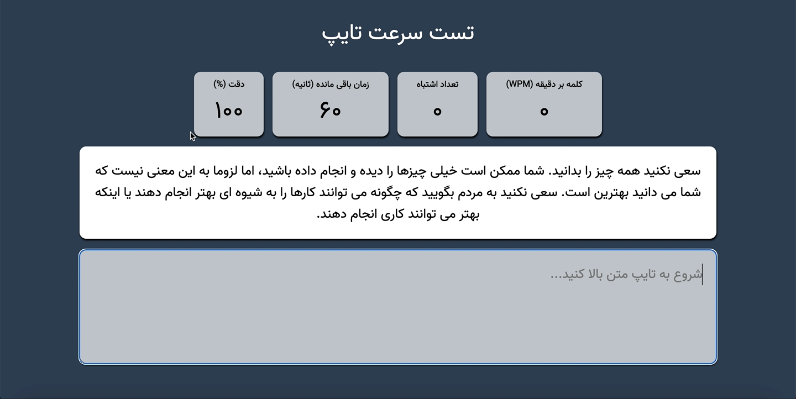

# Type Speed Test

A Javascript (web-based) page to calculate speed of typing and you can make a challenge for yourself to see how much is your type speed and quality.

I attended in a Front-end challenge, and this was one of project task.

### TODO

I a bit feel this game is a bit buggy and needs to debug.
Contribution is welcomed, You can test the project, and send PR.
